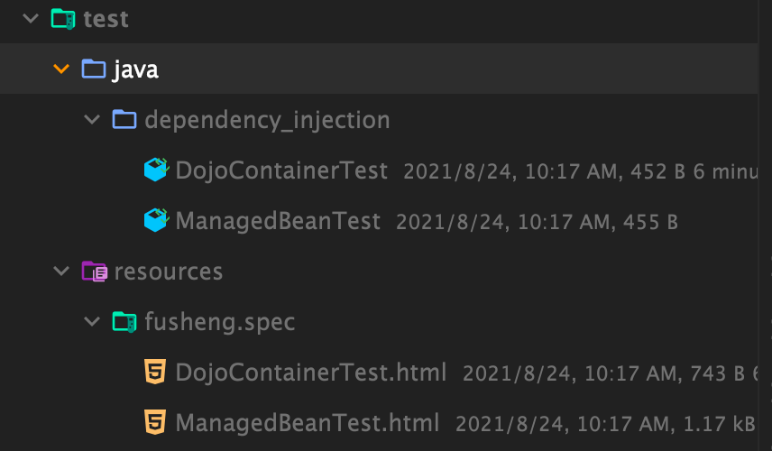

# Fusheng

a plugin used together with [fusheng runner](../runner) to help you
write [SBE](https://en.wikipedia.org/wiki/Specification_by_example#:~:text=Specification%20by%20example%20(SBE)%20is,examples%20instead%20of%20abstract%20statements.)
with living doc. you will find this plugin similar to [concordion](https://concordion.org/) in some way(writing SBE) but
the advantage of this plugin are writing SBE with living server that means after you finish writing SBE with fusheng
runner you can start the server and change related parameters to do real time experiment on your SBE.

## install the `fusheng runner` with gradle dependency

```groovy
dependencies {
    testImplementation 'io.github.thxno:fusheng-runner:1.0'
}
```

## write your spec with `fusheng runner`
* create a test folder under `/src/test/resources/fusheng/spec`
* create a html file to write SBE, like following example, for more details please reference `fusheng runner` Readme.md

* create corresponding **fixture** for above test in `, the file name should map to the spec file and the structure looks like below

* run the fusheng test in the fixture to generate report, need to add annotation `@FushengTest`

* the report will be generated under `{projectDir}/build/reports/tests/fusheng/result` 

## start the server
after you generate the report now you can start fusheng server to check and experiment spec on real time
* run command `./gradlew startLivingDoc` and check `http://localhost:26868/fusheng/index`
 